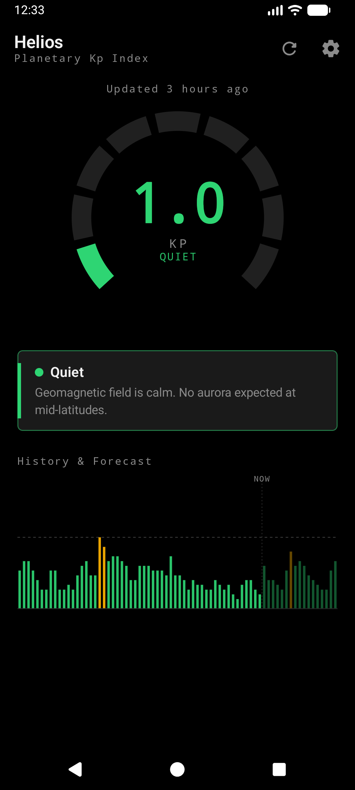
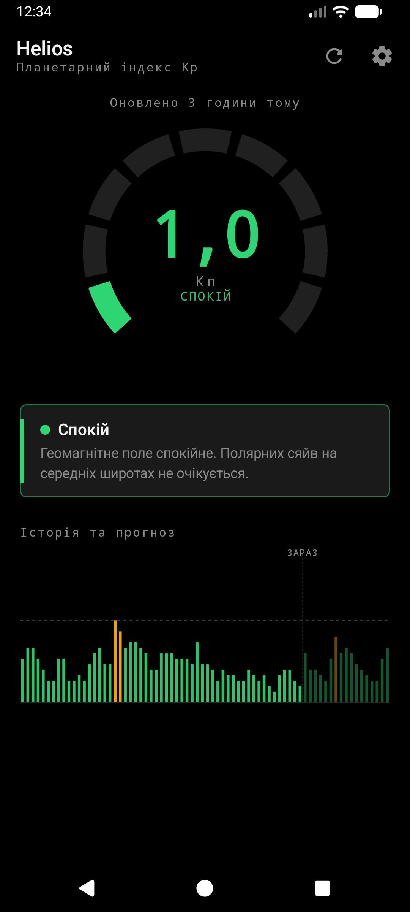
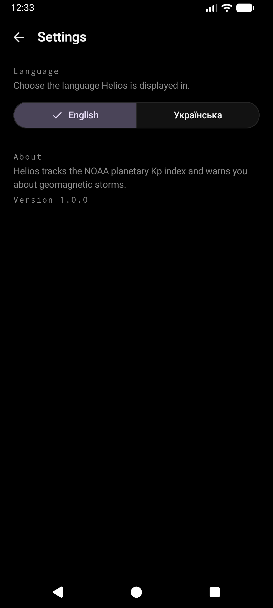

# Helios

A sleek, dark-mode-first Android app that tracks solar activity (the NOAA planetary **Kp index**)
and warns you about geomagnetic storms — no third-party dashboards, no bloat. Offline-first, with
runtime English/Ukrainian switching.

<p align="center">
  
  
  
</p>

---

## Features

- **Live Kp dashboard** — a custom Compose-Canvas segmented gauge for the current Kp, a human-readable
  threat panel (with the NOAA G-scale), and a history + forecast timeline you can scrub.
- **Offline-first** — the UI always renders the last known state instantly from a local Room cache;
  the network is never on the read path.
- **Storm alerts** — a background worker polls NOAA every 30 minutes and fires a local notification
  when Kp reaches storm level (**Kp ≥ 5**), with **anti-spam** logic so you aren't pinged repeatedly
  for the same storm within 12 hours (unless it escalates).
- **Per-app language** — switch between **English** and **Українська** at runtime via the modern
  `AppCompatDelegate.setApplicationLocales` API. Even notifications are localized.
- **Brutalist dark theme** — true-black OLED surfaces; color is reserved strictly for data
  (Green ≤ 3, Amber 4–5, Crimson 6+).

## Architecture

Clean Architecture with an **MVI** presentation layer, Kotlin Coroutines + `StateFlow`, and Hilt DI.

```
┌─────────────────────────── ui (MVI) ───────────────────────────┐
│  DashboardScreen / SettingsScreen  ◀─ State ── ViewModel        │
│  Canvas: KpGauge · KpTimelineChart · ThreatStatusPanel          │
└───────────────┬─────────────────────────────────▲──────────────┘
                │ intents                          │ Flow<KpSnapshot>
┌───────────────▼─────────── domain ───────────────┴──────────────┐
│  KpReading · KpSnapshot · KpRepository (interface)               │
└───────────────┬─────────────────────────────────▲──────────────┘
                │                                  │
┌───────────────▼─────────── data ─────────────────┴──────────────┐
│  KpRepositoryImpl                                                │
│   ├─ remote:  NoaaApi (Retrofit) + tolerant NoaaKpDeserializer   │
│   ├─ local:   Room (offline-first source of truth)               │
│   └─ datastore: NotificationPreferences (anti-spam state)        │
└──────────────────────────────────────────────────────────────────┘
        ▲ work: KpSyncWorker (WorkManager) · notification: StormNotifier
```

### Tech stack

| Concern | Choice |
|---|---|
| Language / UI | Kotlin · Jetpack Compose (Material 3) |
| Architecture | Clean Architecture + MVI · Coroutines · StateFlow |
| DI | Hilt (+ Hilt-WorkManager) |
| Networking | Retrofit + OkHttp · kotlinx.serialization |
| Cache | Room · 5-minute OkHttp HTTP cache |
| Background | WorkManager (30-min periodic sync) |
| Preferences | DataStore (notification anti-spam state) |
| Min / target SDK | 26 / 35 |

### Data source & format tolerance

Helios reads two NOAA SWPC products:

- Current Kp — `https://services.swpc.noaa.gov/products/noaa-planetary-k-index.json`
- Kp forecast — `https://services.swpc.noaa.gov/products/noaa-planetary-k-index-forecast.json`

`NoaaKpDeserializer` is **format-tolerant**: it parses both the modern numeric-object shape (which the
live 2026 API returns) and the legacy array-of-arrays shape, matching fields case-insensitively and
by intent. The observed product keys the value `Kp` while the forecast uses `kp`; both work. Tolerance
lives entirely in the deserializer, so the rest of the app only ever sees a normalized row — and a
future format change is a one-file fix. These parsers are covered by unit tests against real payloads.

### Notifications & anti-spam

`KpSyncWorker` refreshes the cache, then asks `NotificationPreferences.decide(...)` whether to alert.
The rule (pure and unit-tested): fire only at **Kp ≥ 5** AND (the last alert was over **12h** ago **OR**
the storm **escalated** beyond the last alerted Kp). Notification copy is resolved against the active
**per-app locale**, so a background alert matches the in-app language even on a differently-configured
phone.

## Project structure

```
app/src/main/java/com/helios/spaceweather/
├─ core/theme/         # Color, Theme (force-dark), Type, Shape
├─ core/util/          # KpThreatLevel (Kp→color/label), Haptics
├─ domain/             # KpReading, KpSnapshot, KpRepository
├─ data/
│  ├─ remote/          # NoaaApi, tolerant DTO + deserializer, mapper
│  ├─ local/           # Room database, DAO, entity
│  ├─ datastore/       # NotificationPreferences (anti-spam)
│  └─ repository/      # KpRepositoryImpl
├─ di/                 # Hilt modules (network, db, repo, dispatchers)
├─ work/               # KpSyncWorker, SyncScheduler
├─ notification/       # StormNotifier, permission composable
├─ ui/dashboard/       # MVI contract, ViewModel, screen, Canvas components
├─ ui/settings/        # Language switcher (setApplicationLocales)
└─ ui/navigation/      # NavHost, destinations
```

## Getting started

### Prerequisites
- JDK 17
- Android SDK (via Android Studio) with a device/emulator (API 26+)

### Setup

```bash
./setup.sh        # verifies JDK 17, locates the SDK, writes local.properties, primes Gradle
```

### Build & run

This repo ships a [`Justfile`](./Justfile) for common tasks (run `just` to list them):

```bash
just build        # assemble the debug APK
just run          # build, install, and launch on a connected device
just test         # unit tests
just check        # lint + tests + assemble (pre-push gate)
just copy-apk     # copy the built APK to the macOS clipboard
```

…or use Gradle directly:

```bash
./gradlew :app:assembleDebug
./gradlew :app:testDebugUnitTest
```

## Testing

Unit tests cover the two highest-risk pieces of logic:

- **NOAA parsing** (`NoaaKpParsingTest`) — both wire formats, the live 2026 capital-`Kp` payload,
  empty input, and graceful row-dropping.
- **Anti-spam decision** (`AntiSpamDecisionTest`) — threshold, first alert, cool-down suppression,
  escalation override, post-cool-down re-fire, and the inclusive boundary.

```bash
./gradlew :app:testDebugUnitTest
```

## License

Released under the MIT License. NOAA SWPC data is in the public domain.
